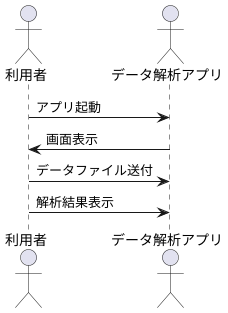

※このプロジェクトは[Create React App](https://github.com/facebook/create-react-app)によって作成されました。

※この document は、[Markdown+PlantUML](https://qiita.com/koara-local/items/e7a7a7d68a4f99a91ab1)にて作成しました。

# プロジェクトの立ち上げ方法

以下の通りにして環境の構築を行う。

1. node.js のインストール

[Nodejs](https://nodejs.org/ja/)から、推奨版の Node.js をインストール。

2. create-react-app コマンドのインストール

```
npm install -g create-react-app
```

で create-react-app をインストール。
詳細は、

[Create React App](https://github.com/facebook/create-react-app)

[React 初心者が環境構築でつまづかないための Create React App の始め方](https://www.webprofessional.jp/create-react-app/)

を参照。

3. プロジェクトを作成するフォルダにて、以下のコマンドを実行し、react のプロジェクトを作成する。

```
create-react-app project名
```

```
cd project名
```

4. redux, react-redux,react-bootstrap,bootstrap,electron,electron-packager のインストール

```
yarn add redux
```

```
yarn add react-redux
```

```
yarn add electron --save-dev
```

```
yarn add electron-packager --save-dev
```

npm install だと、うまく動かないことがあった、、

5. 諸設定

package.json に以下の項目を追記する。

```
  "main": "src/electron-main.js",
  "homepage": "./",

    "scripts": {
    "electron": "node_modules/.bin/electron .",
    "electron-packager": "node_modules/.bin/electron-packager . --overwrite --asar=true --platform=win32 --arch=ia32 --prune=true --out=release-builds  --electronVersion=3.0.9"
     },
```

参考

[React+Electron アプリを作ってみよう](https://dev.to/origamium/create-reactelectron-application-in-quickly--36nl)

[【Electron 入門】electron-packager を使ってアプリを配布](https://shinmedia20.com/electron-pakager-introduction)

6. electron 用の main の記述。

プロジェクトフォルダの src フォルダの中に electron-main.js を作成する。
electron-main.js の中身

```
const electron = require('electron');
const app = electron.app;
const BrowserWindow = electron.BrowserWindow;

const path = require('path');
const url = require('url');

let mainWindow;

function createWindow() {
    mainWindow = new BrowserWindow({width: 800, height: 600});
    const startUrl = process.env.ELECTRON_START_URL || url.format({
                pathname: path.join(__dirname, '/../build/index.html'),
                protocol: 'file:',
                slashes: true
            });
    mainWindow.loadURL(startUrl);
    mainWindow.webContents.openDevTools();
    mainWindow.on('closed', function () {
        mainWindow = null;
    });
}

app.on('ready', createWindow);
app.on('window-all-closed', function () {
    if (process.platform !== 'darwin') {
        app.quit();
    }
});

app.on('activate', function () {
    if (mainWindow === null) {
        createWindow();
    }
});
```

取り急ぎ動かすだけの最低限の記述。ただ、react プロジェクトを build しないと動かない。（startUrl で読み込んでいる html が、build 後のフォルダのため。）

# プロジェクトのビルド（exe 化）方法

1. React プロジェクトのビルド方法

以下のコマンドを実行。

```
yarn build
```

yarn はフォルダ内の package.json に記述した、"scripts"のコマンドを読み込む。

2. electron コマンドでアプリが起動するか確認。

```
yarn electron
```

起動すれば成功。

3. electron-packager の実行で exe 化。

```
yarn electron-packager
```

で exe 化。少し時間がかかります。

electron-packager の option は、ググってください。

# シーケンス



# 参考資料

[React Bootstrap](https://react-bootstrap.github.io/)
[React Dropzone](https://react-dropzone.js.org/)
[React ドキュメント](https://ja.reactjs.org/docs/hello-world.html)
[電卓アプリで学ぶ React/Redux 入門(実装編)](https://qiita.com/nishina555/items/9ff744a897af8ed1679b)
